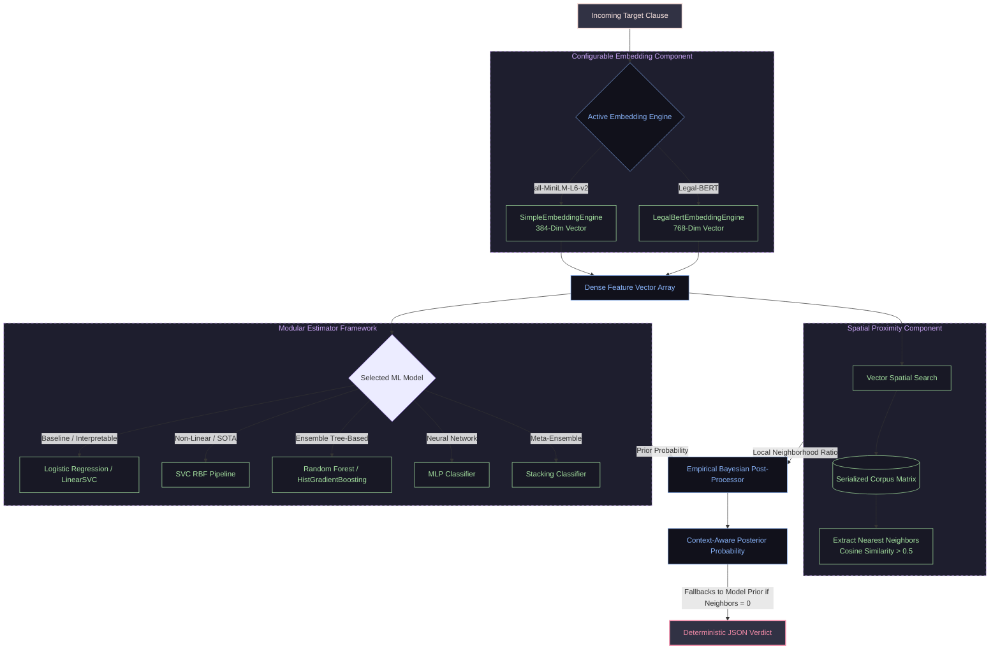

# enhesa-tos-service

A production-grade Python service implementing semantic similarity search and legal compliance risk classification on the CLAUDETTE corpus. Built with clean modular architecture, rigorous experimental methodology, and robust data alignment pipelines. The decoupled core engine features comprehensive REST API endpoints and a containerized runtime environment.

---

## Context

Most consumers accept online Terms of Service (ToS) contracts without reading them, creating a severe informational asymmetry that online platforms frequently exploit by hiding legally unfair or detrimental clauses. While European consumer law prohibits these practices, consumer protection agencies lack the labor and resources to manually audit thousands of text-dense documents.  To solve this bottleneck, this project builds a containerized, production-ready backend service that utilizes semantic search and machine learning (ML) classification, trained on the CLAUDETTE corpus dataset (Lippi et al., 2019). It automatically detects potentially unfair clauses at a sentence level without relying on massive, high-latency Large Language Models (LLMs).  

---

## Technical Grounding & Literature Context

To establish enterprise credibility and defensibility , the architectural decisions implemented across this codebase are firmly grounded in recent peer-reviewed scientific literature:  
- Embedding Superiority: Moving beyond the original baseline bag-of-words (BoW) and TF-IDF models established by Lippi et al. (2019) (which topped out at a macro F1 of 0.806) , this architecture embraces dense text vectors.  
- Domain-Specific Advantage: Following Akash et al. (2024), we map clauses to a specialized Legal-BERT space, which dramatically outperforms general-purpose models (like all-MiniLM-L6-v2) by successfully capturing deep semantic nuances and avoiding vocabulary fragmentation on complex contractual terminology.  
- Classifier Optimization: While a broad experimental matrix was evaluated (spanning Logistic Regression, LinearSVC, Random Forests, Histogram Gradient Boosting, and MLPs) , our testing validated that pairing Legal-BERT with an RBF-Kernel Support Vector Classifier (SVC RBF) yields the strongest standalone performance topology, nearly matching state-of-the-art benchmarks (Macro F1 of 0.871).

---

## System Architecture & Data Fl



For more details, the user is referred to the [Report.pdf](Report.pdf).

---


## Prerequisites
Docker and Docker Compose installed locally.

Note for Linux users: Ensure your user is appended to the docker group, or prefix operational commands with sudo.


## Run Guidelines
### Step 1. Spin up the Containerized API
Run the orchestration layout command to build your environment and boot the REST interface.

For Standard (macOS, Windows, or configured Linux):
```
docker build --no-cache -t enhesa-tos-api .
```

The Linux fallback (if daemon socket permissions are not configured):
```
sudo docker build --no-cache -t enhesa-tos-api .
```

### Step 2. Fire up the Containers
For Standard (macOS, Windows, or configured Linux):
```
docker-compose up
```

The Linux fallback (if daemon socket permissions are not configured):
```
sudo docker-compose up
```

### Testing the API
curl -X POST http://localhost:8000/api/v1/analyze \
     -H "Content-Type: application/json" \
     -d '{"sentence": "The provider reserves the right to modify these terms at any time without prior notification.", "top_k":3}'


### Running the UI

Start your backend server
```
poetry run uvicorn src.api.main:app --reload --port 8000
```

Start frontend app
```
poetry run streamlit run ui/app.py
```